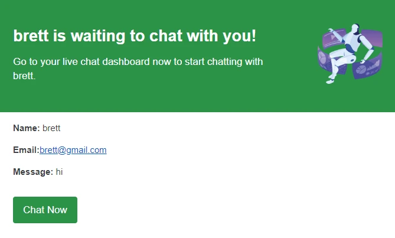

There are many options when it comes to choosing the best chatbot for your Wix website. In this article, we will go over ChatBuild.io’s chatbot and why it might be the best option for your website.

Integrating a chatbot widget on your website can increase sales by up to ~67% according to [Forbes](https://www.forbes.com/sites/gilpress/2019/11/25/ai-stats-news-chatbots-increase-sales-by-67-but-87-of-consumers-prefer-humans/). So, choosing the correct chatbot is essential for increasing your bottom-line revenue.

<Image src='chatbot.webp' width={400} height={300} alt='img' className= 'my-8'/>
## Benefits of Using a Chatbot on Your Website

- **Instant customer support** - Your website users will get immediate help and don’t have to wait in long queue lines.
- **24/7 support** - Even if you are sleeping, your chatbot never does. This means you can provide support outside of business hours.
- **Increased conversions** - Turn your causal browsers into paying customers who were on the fence.
- **Trained Chatbot** - The chatbot can be trained on your data points so it’s like having another knowledgeable employee working around the clock.

## [ChatBuild.io](https://www.chatbuild.io) - AI Chatbot with Real-Time Customer Support Functionality

[ChatBuild.io](http://ChatBuild.io) is a software that allows users to create custom trained AI chatbots for your website in just a few minutes. No coding experience is required.

The other cool feature that makes ChatBuild stand out above the rest is having the ability to enable or disable a real-time human support feature on all their plans.

### Ease of Integration with Wix

<YouTubeVideo videoId="IV6sChTZFLQ"/>
Seamlessly integrate ChatBuild’s chatbot with a simple script tag that will be copied and pasted in the head tag of your website which is located on your Wix’s dashboard. Here is a simple **[step-by-step article](https://help.socialintents.com/article/162-how-to-add-javascript-to-your-wix-website)** on how to use custom code to paste a script tag on your Wix website.

### Customization Options

ChatBuild gives the ability to customize how your chatbot will look on your website. You can customize the color, logo, chatbot name, welcome message and much more.

The main customization option comes with the training of the chatbot. ChatBuild gives the user the option to upload pdf, txt, csv, mdx & html files.

You can also upload your sitemap or specific URLs that the chatbot will gain knowledge from. These customization options make your chatbot unique to your business, ensuring it can effectively answer your website visitors' questions rather than being a generic chatbot with limited knowledge.

### Enable Real-Time Chat Support

This chatbot offers not only AI conversational messages but also real-time human chat. This feature allows you to assist people who need help from a real person.

Some people dislike interacting with AI chatbots and find them frustrating, making human support sometimes necessary.

ChatBuild sends SMS or email notifications when someone requests to chat with a real person. This enables you to respond promptly to your website visitors.

You have the option to disable the live chat feature if you prefer to rely solely on AI or lack the manpower to handle real-time inquiries.
<TwitterCard tweetId="1849223177362174256" />

### Cost & Pricing Plans

ChatBuild gives a generous free tier to all signed-up accounts. This free tier includes 300 messages that can be sent back and forth with your website visitors. This means 150 messages from the user and 150 messages from your chatbot.

You can upload files to train your chatbot, so you can see how your AI chatbot would interact with potential customers.

The good thing about the free plan is that no credit card is required.

Pricing plans start at $39.99 per month. View the plans on the **[pricing page](https://www.chatbuild.io/pricing)**.

## Conclusion

If you are serious about increasing your sales and just overall customer satisfaction then ChatBuild is a really solid option.

ChatBuild is by far the best bang for your buck because most other AI chatbots only offer conversational AI capabilities and not a real-time chat feature option.

Being able to have both real-time chat and an AI chatbot allows you to cater to all website visitors no matter if they want to talk to a real human or not.

Try out [https://www.Chatbuild.io](http://Chatbuild.io) today!
